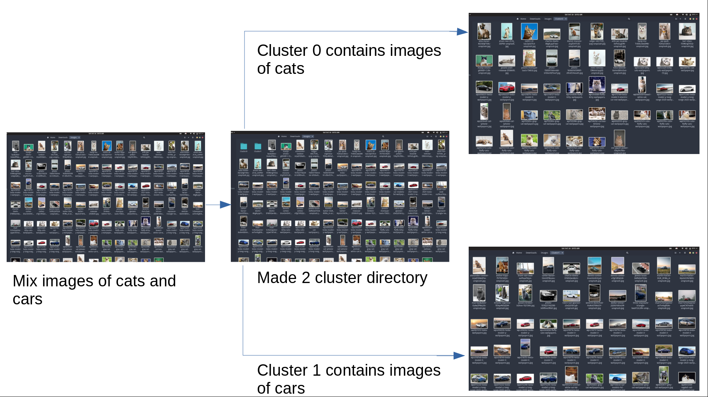
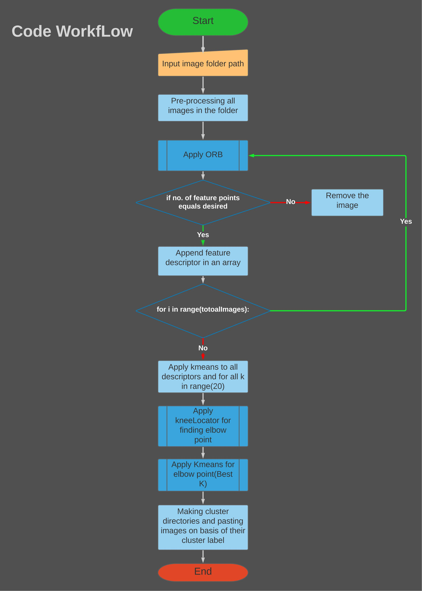

# IMAGE_GROUPING

Segregates images using feature extraction and Clustering algorithm

## Table of Contents

- [About the Project](#about-the-project)
    - [Aim](#aim)
    - [Description](#description)
    - [Tech Stack](#tech-stack)
    - [File Structure](#file-structure)
- [Getting Started](#getting-started)
    - [Prerequisites](#prerequisites)
    - [Installation](#installation)
- [Usage](#usage)
- [Results and Demo](#results-and-demo)
- [Future Work](#to-dos)
- [Troubleshooting](#troubleshooting)
- [Contributors](#contributors)
- [Acknowledgements and Resources](#acknowledgements-and-resources)
- [License](#license)

## About The Project

### Aim

This project aims at creating an image grouping algorithm. The algorithm should be able to group similar images on the basis of extracted features.

### Description

We have used ORB algorithm for extracting features and Scikit K-means clustering algorithm to clusterize images. So it reads images from a folder and applies ORB to all images to give its descriptors and finds optimum no. of groups(K) then applies K-means on descriptors and paste images to their respective cluster folder. For more info refer our [report](report/report.pdf)



### Tech Stack

- [OpenCV](https://opencv.org/)
- [Scikit Learn](https://scikit-learn.org/stable/)

### File Structure

```bash
.📦
├── 📂assets				# contains images and video			
│   ├── 📜demo.mp4												 
│   └── 📜overview.png									  
├── 📜kmeansUsingOpenCV.py		# code with openCV kmeans 
├── 📜kmeansUsingSkLearn.py		# code with SkLearn kmeans
├── 📜LICENSE				# MIT license
├── 📜README.md				
└── 📂report				# Project report
    └── 📜report.pdf
```

## Getting Started

### Prerequisites

- Should have python environment. You can refer [here](https://www.tutorialspoint.com/python/python_environment.htm) for the setup.
- Python librairies
    - [OpenCV](https://pypi.org/project/opencv-python/) `pip install opencv-python`
    - [Scikit](https://scikit-learn.org/stable/install.html) `pip install scikit-learn`
    - [numpy](https://numpy.org/install/) `pip install numpy`
    - [kneed](https://pypi.org/project/kneed/) `pip install kneed`

For installation of pip you can refer [here](https://www.geeksforgeeks.org/how-to-install-pip-on-windows/)

- Must have Test Data, or you can get it from [here](https://drive.google.com/file/d/1wu7fiQ0NtBH5s2wu4JrZEnFjwblHCOlX/view?usp=sharing) and from [kaggle](https://www.kaggle.com/datasets).

### Installation

1.  Clone the repo
    
    ```git
    git clone https://github.com/shahpratham/Image_Grouping.git
    ```
    

### Usage

```bash
cd /path/to/Image_Grouping
```

> For using Sklearn K-means use this, similar can be done openCV code

```python
python kmeansUsingSkLearn.py
```

> For viewing Cluster Directory

```
cd /path/to/TestDAta
```

### THEORY AND APPROACH:

Select assorted images of single label test subjects like for example cats & cars. Apply the clustering algorithm to find images of cats in one folder & cars in a seperate folder. It reads images from a folder and applies ORB to all images to give its descriptors and find optimum value of k and applies K-means on descriptors and paste images to their respective cluster folder.

- **Preprocessing**

To group images, it requires processing the images under test. Image processing is the operation of converting images into computer readable data. To perform the necessary operations we processed the images using the OpenCV python library which allows us to read images in matrix format.

- **Feature extraction via Orb**

Now we need to extract features from the image to understand the contents of the image. A feature / keypoint is a piece of information about the content of an image; typically about whether a certain region of the image has certain properties.These features are stored in the computer memory in the form of descriptors. The descriptor contains the visual description of the patch and is used to compare the similarity between image features. So, by applying openCV ORB to all images, we stored all keypoints and descriptors of images in the list.

- **K-Means clustering**

So, after getting descriptors of all images, we need to cluster them by using K-Means clustering. First we need to find no. of clusters so we are doing that by applying the elbow method using distortions. K-means clustering is a method of vector quantization, originally from signal processing, that aims to partition n observations into k clusters in which each observation belongs to the cluster with the nearest mean.

- **Making directories for cluster and pasting image to its respective directory(cluster)**

Now we have all images labeled(cluster number), we can group them by making separate directories using os library and copy paste images from the main folder to their respective directories by shutil.



## Results and Demo

|     |     |
| --- | --- |
| **Task** | **Time Taken (in seconds)** |
| Pre-processing | 5.941 |
| Feature Extraction | 48.796 |
| Finding no. of clusters (Optimum k) | 19.147 |
| Clustering | 0.874 |
| Creating Directories and pasting images | 0.757 |

> Did this for 101 images and tested on Lenovo Legion 5(Ryzen 5 4600H) and got accuracy close to 80%. 
>We tried on our K-Means code from scratch(you can get in dev branch-- kmeans.py) and got accuracy around 55-65%. 

https://user-images.githubusercontent.com/82367556/138555814-7c4239b9-68de-4b3e-8819-0105db80de8b.mp4


## Future work

- [x] Finding optimum of K
- [ ] Improving accuracy
- [ ] Make a web app where one can upload images and can cluster it online.

## Troubleshooting

- Changing parameters like `nfeatures`,  `edgeThreshold`and `fastThreshold` in `ORB_create` can prove to be effective for some datasets
- The ideal way for dealing with outliers was to increase your test data
- After changing max cluster value from 10 to 20, `KneeLocator` was able to find optimum value

## Contributors

- [Pratham Shah](https://github.com/shahpratham)
- [Yash Deshpande](https://github.com/yashLM705)

## Acknowledgements and Resources

- [SRA VJTI](https://github.com/SRA-VJTI) Eklavya 2021
- Our mentors [Mann Doshi](https://github.com/MannDoshi) and [Prathamesh Tagore](https://github.com/meshtag) for their guidance throughout this project
- [K-means Research Paper](https://ieeexplore.ieee.org/document/5453745)
- [ORB Research Paper](https://ieeexplore.ieee.org/document/6126544?denied=)
- [Optimum K](https://www.geeksforgeeks.org/elbow-method-for-optimal-value-of-k-in-kmeans/)
- For more resources refer References section in [report](report/report.pdf)

## License

The [License](LICENSE) used in this project
